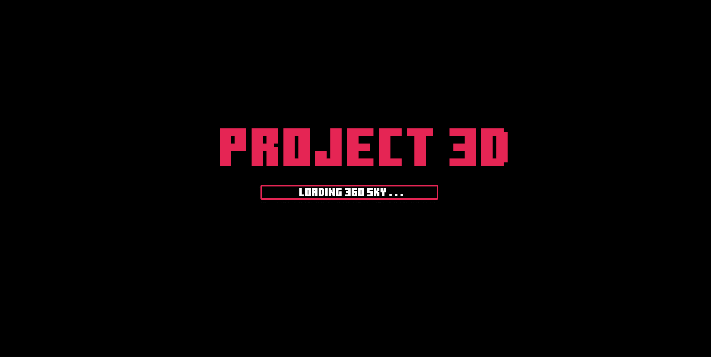
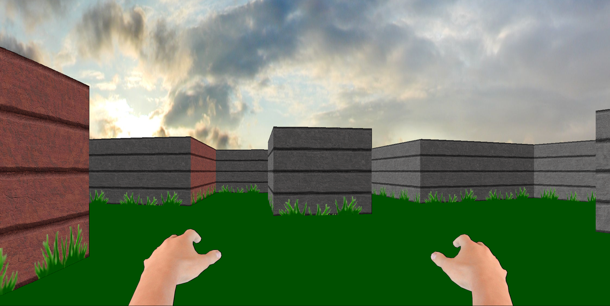
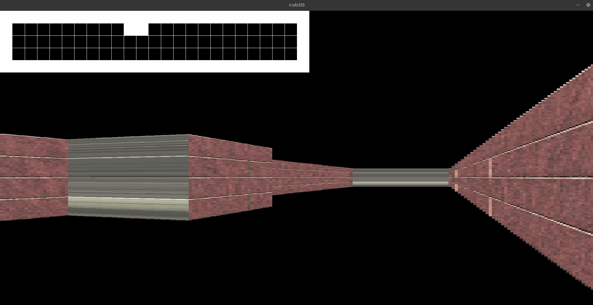
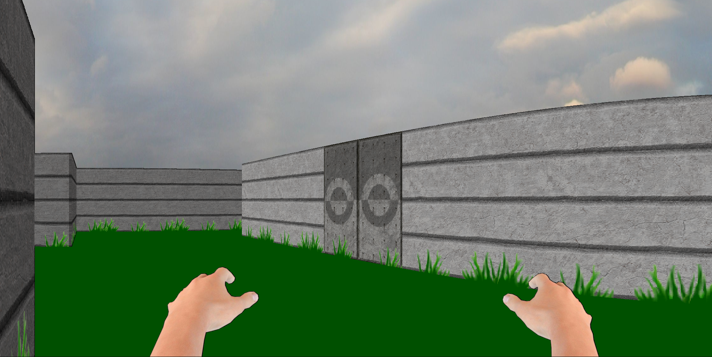

# Cub3D / PROJECT3D

This project is a 3D game implemented using the MinilibX library and developed in collaboration with [Doboy](https://github.com/Doboy9). 

### Features

Our Cub3D offers a smooth and immersive experience in Full HD. The game includes a small menu and graphical options to enhance the visual appeal of the sky. Whether you prefer a customizable sky color, a fixed sky texture, or a 360-degree realistic sky.

Follow the instructions below to get started.

<div style="display: flex; justify-content: space-between;">
    
    
</div>


## Getting Started

### Prerequisites

Make sure you have the necessary tools installed:
- `git`
- `make`
- `gcc` or another compatible C compiler

### Installation

1. Clone the repository:
    ```sh
    git clone https://github.com/nedulk/cub3D.git
    ```

2. Navigate to the project directory:
    ```sh
    cd Cub3D
    ```

3. Validate and download the MinilibX library:
    ```sh
    make mlx
    ```

    - When prompted, type `y` to download the MinilibX library.

4. Compile the project:
    ```sh
    make
    ```

    - This will compile the main version of Cub3D.

5. For the full game with all options, compile with:
    ```sh
    make bonus
    ```

### Customizing the Sky

You can choose the state of the sky during compilation:

- For a customizable sky color (defined in the `.cub` map files):
    ```sh
    make bonus SKY=0
    ```

- For a fixed sky texture:
    ```sh
    make bonus SKY=1
    ```

- For a 360-degree realistic sky:
    ```sh
    make bonus SKY=2
    ```

### Running the Game

Once compiled, you can run the game using the following command:
```sh
./cub3D <path_to_map_file>
```
For the version with all options, use `./cub3D_bonus`.

### Controls

Here are the default controls for Cub3D:

- **Movement**: Use `W`, `A`, `S`, `D` to move your character.
- **Interact**: Press `E` to open or close doors.
- **Minimap**: Press `Tab` to display the minimap.

### Changing the Map

You can have fun by changing the map files located in the `maps` folder. Simply edit or replace the existing `.cub` files to modify the game environment.

### First render / Last render (pas mal non ? C'est Breton et Normand)

<div style="display: flex; justify-content: space-between;">
    
    
</div>


